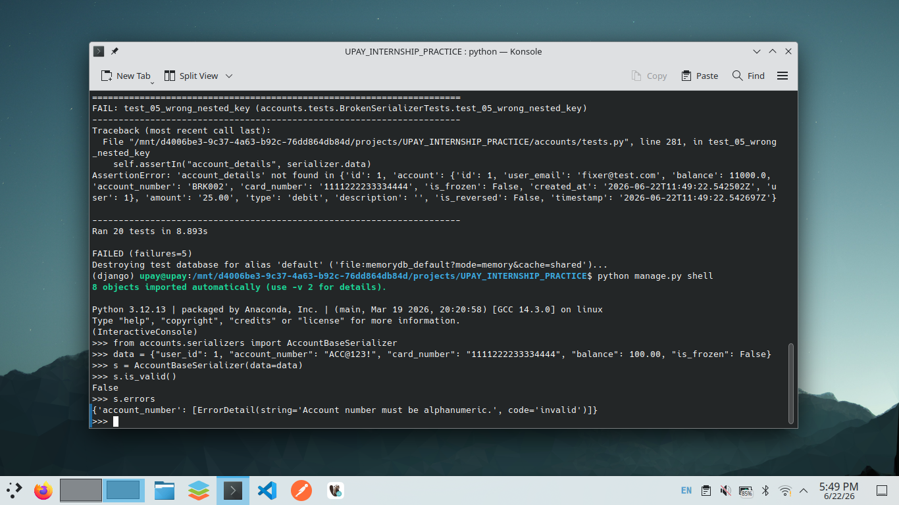
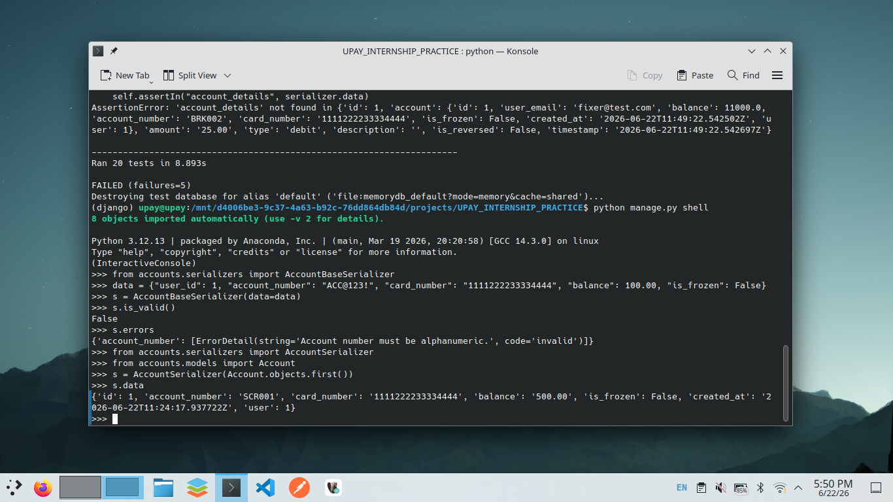
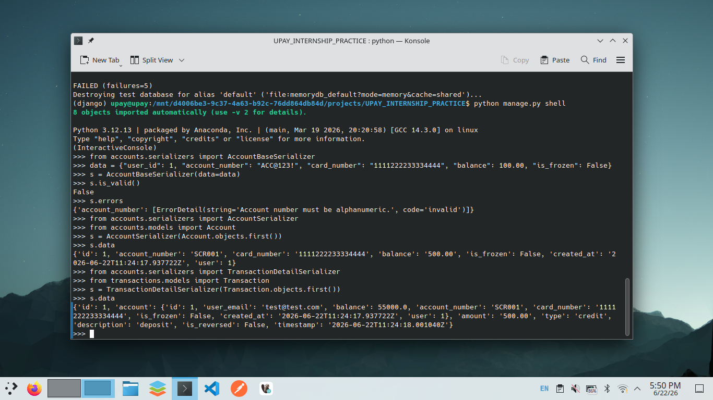
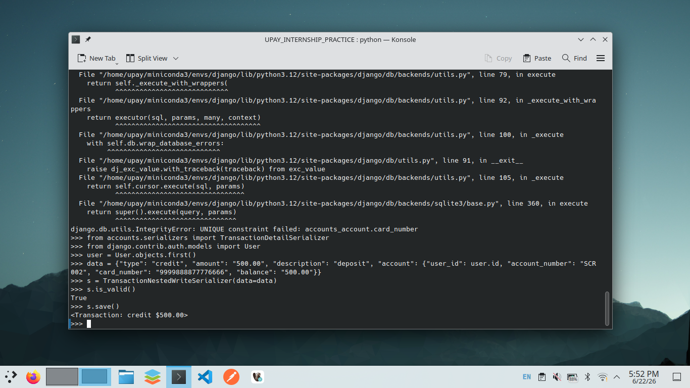
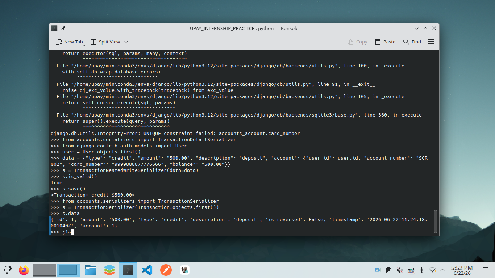

# Comparison Between Serializer Types

## Plain Serializer

We use this when there is no model backing the data or when create update logic spans multiple models. We define all fields manually and write create and update by ourselves.

**Project examples**
AccountBaseSerializer and TransactionNestedWriteSerializer

**When to use**
- Data comes from an external API or is computed at runtime
- A single payload must create multiple model instances
- Validation logic is complex and cross field

## ModelSerializer

We use this when the data maps directly to a single Django model. The serializer auto generates fields and handles create and update with no extra code.

**Project examples**
AccountSerializer and TransactionSerializer

**When to use**
- Standard CRUD endpoints
- No custom create or update logic required
- Model field validators are sufficient

## Nested Serializer

We use this when we need parent and child data in a single request or response.

**Read only**
Embed a ModelSerializer and set read only to true. Simple and safe.

Project example: TransactionDetailSerializer embeds AccountDetailSerializer

**Writeable**
We use a plain Serializer with child serializers. We write create and update manually to handle the child data.

Project example: TransactionNestedWriteSerializer with NestedAccountWriteSerializer

## Flat Serializer

We use this when the data lives in one model with no relations to expose. The output is a single flat JSON object.

**Project example**
TransactionSerializer

## Other Variants

| Variant | Purpose | Example |
|---------|---------|---------|
| ListSerializer | Bulk create or update | AccountListSerializer on AccountBulkSerializer |
| SerializerMethodField | Computed fields | AccountStatementSerializer transaction count and totals |
| source argument | Pull a related field without nesting | AccountDetailSerializer user email |
| to representation override | Transform output | AccountOverrideSerializer status and balance formatted |
| to internal value override | Transform input before validation | AccountOverrideSerializer status to is frozen |
