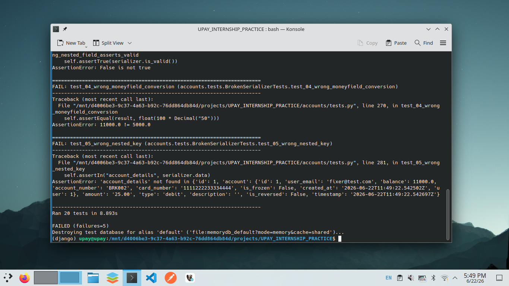
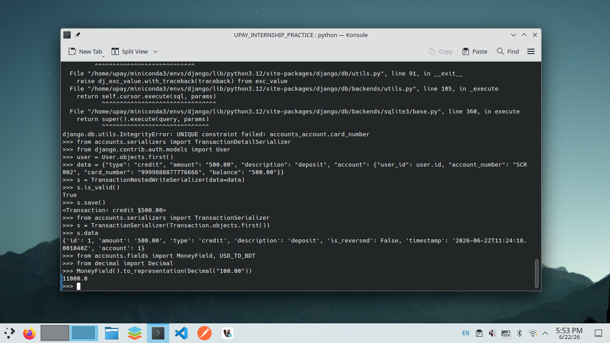
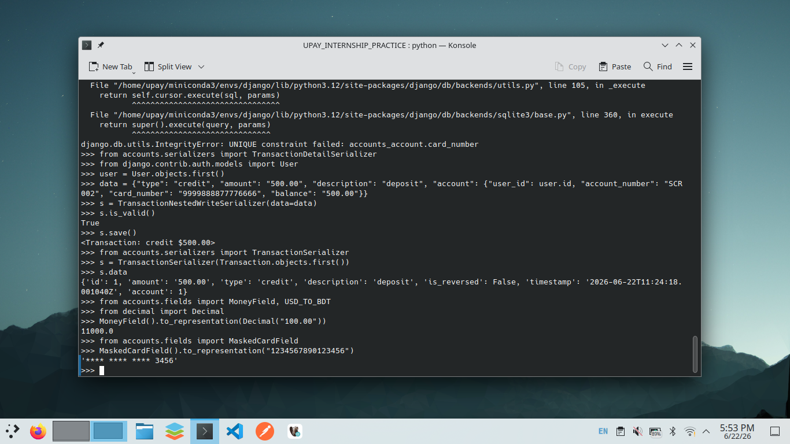
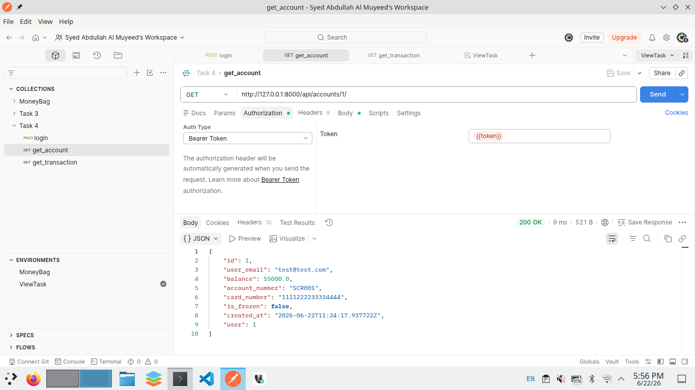
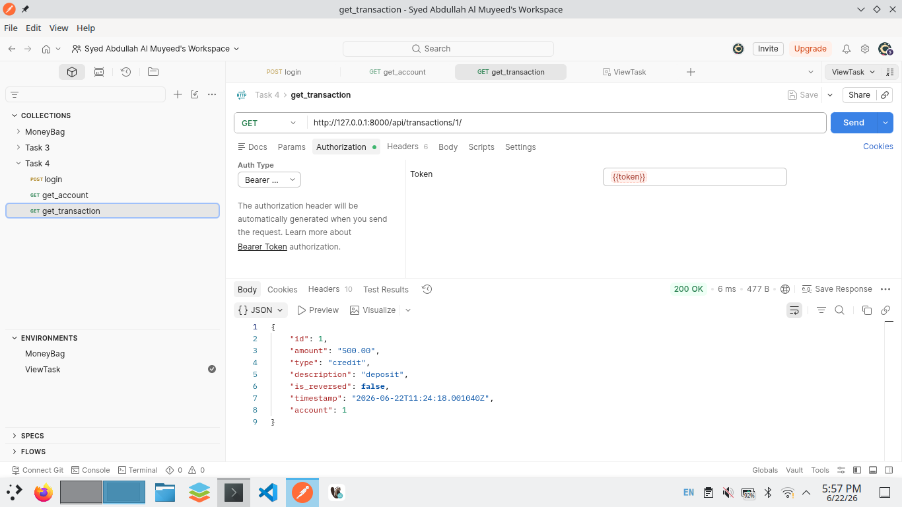

# DRF Serializer Practice

**Name:** Syed Abdullah Al Muyeed  
**ID:** FT0061-I  
**Designation:** Information Technology Intern

## Serializers

| Serializer | Type | Purpose |
|------------|------|---------|
| AccountBaseSerializer | Serializer | Manual fields, custom create update, validators |
| AccountSerializer | ModelSerializer | Auto generated from Account model |
| AccountDetailSerializer | ModelSerializer | Adds user email via source from related User |
| AccountBulkSerializer | ModelSerializer | Bulk create with ListSerializer |
| TransactionSerializer | ModelSerializer | Flat transaction fields |
| TransactionDetailSerializer | ModelSerializer nested | Embeds AccountDetailSerializer with user email |
| TransactionNestedWriteSerializer | Serializer nested write | Creates Transaction and Account in one call |
| AccountStatementSerializer | ModelSerializer | SerializerMethodField for computed fields |
| AccountOverrideSerializer | ModelSerializer | Custom to representation and to internal value |



## Custom Fields

**MoneyField**
Stores USD values. Displays values in BDT at 1 USD equals 110 BDT. Converts via to representation and to internal value.



**MaskedCardField**
Stores the full 16 digit card number. Displays only the last four digits with asterisks for the rest.



## API Endpoints

### Accounts

| Method | Endpoint | Serializer |
|--------|----------|------------|
| GET POST | api accounts | AccountSerializer |
| GET | api accounts id | AccountDetailSerializer |
| PUT PATCH DELETE | api accounts id | AccountSerializer |
| POST | api accounts id freeze | Toggle frozen status |
| GET | api accounts id statement | AccountStatementSerializer |



### Transactions

| Method | Endpoint | Serializer |
|--------|----------|------------|
| GET POST | api transactions | TransactionSerializer |
| GET | api transactions id | TransactionDetailSerializer |
| PUT PATCH DELETE | api transactions id | TransactionSerializer |
| POST | api transactions id reverse | Reverse the transaction |



### Batch

| Method | Endpoint | Serializer |
|--------|----------|------------|
| POST | api accounts bulk | AccountBulkSerializer with many true |

### Auth

| Endpoint | Description |
|----------|-------------|
| api token | Obtain JWT pair |
| api token refresh | Refresh JWT |

## Tests

```
python manage.py test accounts.tests -v 2
```
