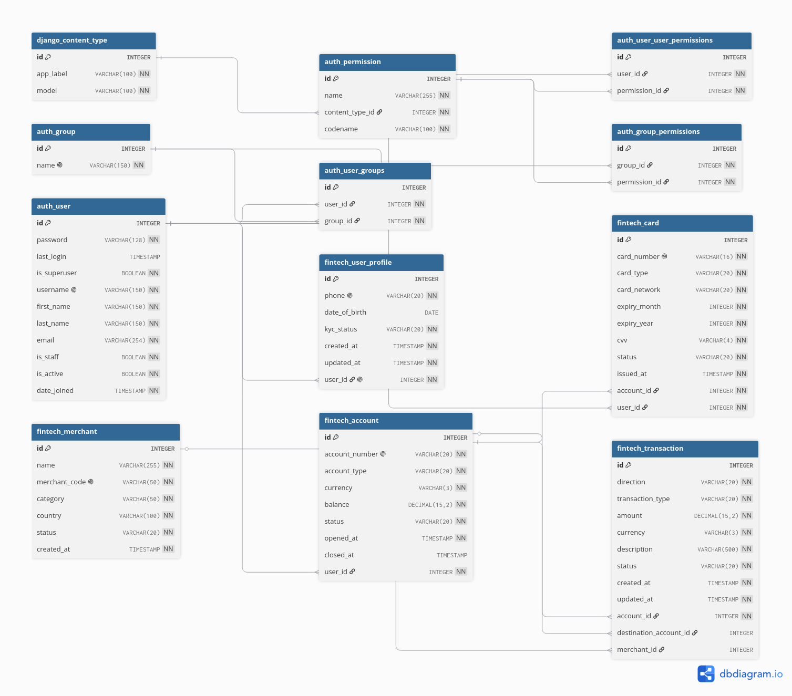
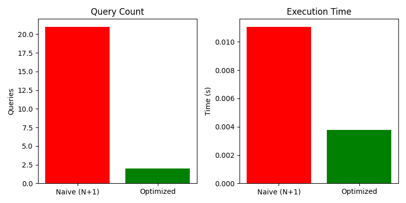

# Django ORM Basics & Fintech Schema

**Name:** Syed Abdullah Al Muyeed  
**ID:** FT0061-I  
**Designation:** Information Technology Intern

---

## 1. Django ORM Concepts

### 1.1 `select_related()`

So when we get an object that has a ForeignKey or OneToOneField, Django makes a new query everytime we access that related thing. This is called N+1 query problem. `select_related()` fixes this by doing SQL JOIN so everything comes in one query.


### 1.2 `prefetch_related()`

For reverse relations and many-to-many fields, select_related() doesnt work because JOIN makes too much duplicate data. prefetch_related() makes a second query and does joining in Python.

**When to use:** Reverse ForeignKey, ManyToManyField, and GenericForeignKey.


### 1.3 `F()` Expressions

F() lets us refer to a model fields current value inside a query. Useful when we want to update based on existing value. Math happens in database, not in Python, so no race conditions.


### 1.4 `Q()` Objects

Normally when we pass multiple arguments to filter(), Django joins them with AND. Q() lets us build complex queries with OR, NOT, and combinations.

We can combine with & (AND), | (OR), and ~ (NOT).


### 1.5 Annotations (`annotate()`)

annotate() adds a calculated field to each row in a queryset. Its like adding a temporary column computed on the fly.


## 2. Fintech Schema Design

### 2.1 Entity-Relationship Diagram


### 2.2 Models Detail

#### UserProfile
| Field | Type | Details |
|-------|------|---------|
| user | OneToOneField(User) | CASCADE delete, related_name="profile" |
| phone | CharField(20) | unique, indexed |
| date_of_birth | DateField | nullable |
| kyc_status | CharField(20) | choices: pending / verified / rejected |

#### Account
| Field | Type | Details |
|-------|------|---------|
| user | ForeignKey(User) | related_name="accounts" |
| account_number | CharField(20) | unique, indexed |
| account_type | CharField(20) | savings / checking / credit / investment |
| currency | CharField(3) | default "BDT" |
| balance | DecimalField(15,2) | MinValueValidator(0.00) |
| status | CharField(20) | active / frozen / closed |


#### Merchant
| Field | Type | Details |
|-------|------|---------|
| name | CharField(255) | |
| merchant_code | CharField(50) | unique, indexed |
| category | CharField(50) | retail / food / travel / tech / etc. |
| country | CharField(100) | default "BD" |
| status | CharField(20) | active / suspended / terminated |

#### Transaction
| Field | Type | Details |
|-------|------|---------|
| account | ForeignKey(Account) | source account |
| destination_account | ForeignKey(Account) | nullable, for transfers |
| direction | CharField(20) | incoming / outgoing |
| transaction_type | CharField(20) | deposit / withdrawal / transfer / payment / refund / fee |
| amount | DecimalField(15,2) | MinValueValidator(0.01) |
| status | CharField(20) | pending / completed / failed / reversed |
| merchant | ForeignKey(Merchant) | nullable |

#### Card
| Field | Type | Details |
|-------|------|---------|
| user | ForeignKey(User) | |
| account | ForeignKey(Account) | |
| card_number | CharField(16) | unique, indexed |
| card_type | CharField(20) | debit / credit / prepaid |
| card_network | CharField(20) | visa / mastercard / amex / discover |
| expiry_month | IntegerField | 1-12 |
| expiry_year | IntegerField | |
| cvv | CharField(4) | |
| status | CharField(20) | active / blocked / expired / cancelled |

---

## 3. 15 ORM Queries

All queries are in `fintech/orm_queries.py`. Below is each query with explanation.

---

### Query 1: select_related - Basic JOIN

```python
from fintech.models import Account

active_accounts = Account.objects.select_related("user").filter(status="active")
```

**What it does:** Gets all active accounts and their user data in one query instead of separate query for each account.

**SQL it generates (roughly):**
```sql
SELECT ... FROM fintech_account
INNER JOIN auth_user ON fintech_account.user_id = auth_user.id
WHERE fintech_account.status = 'active'
```

---

### Query 2: annotate with Count

```python
from django.db.models import Count
from django.contrib.auth.models import User

users_with_account_count = User.objects.annotate(account_count=Count("accounts"))
```

**What it does:** Adds a field called account_count to each user showing how many accounts they own. Normally wed have to loop and query separately for each user.

---

### Query 3: Group by with values().annotate()

```python
from django.db.models import Count, Sum, Avg

balance_by_type = Account.objects.values("account_type").annotate(
    total_balance=Sum("balance"),
    avg_balance=Avg("balance"),
    count=Count("id"),
)
```

**What it does:** Groups accounts by type like savings checking etc and calculates total balance average balance and count for each group. Its like GROUP BY in SQL.

---

### Query 4: F() for atomic updates

```python
from django.db.models import F
from decimal import Decimal

Account.objects.filter(account_type="savings").update(
    balance=F("balance") * Decimal("1.02")
)
```

**What it does:** Gives all savings accounts a 2% interest bonus. The calculation happens in the database so no race conditions (two requests reading same value before either writes it back).

---

### Query 5: Q() for OR conditions

```python
from django.db.models import Q
from datetime import date, timedelta

recent_or_large_txns = Transaction.objects.filter(
    Q(status="completed", amount__gt=Decimal("200.00"))
    | Q(status="failed", created_at__gte=date.today() - timedelta(days=7))
)
```

**What it does:** Finds transactions that are either (completed AND over $200) OR (failed AND from last 7 days). Without Q() we can only do AND conditions.

---

### Query 6: Case/When for conditional labels

```python
from django.db.models import Case, When, Value, CharField

txns_with_tier = Transaction.objects.annotate(
    tier=Case(
        When(amount__lt=Decimal("50.00"), then=Value("small")),
        When(amount__lt=Decimal("200.00"), then=Value("medium")),
        When(amount__lt=Decimal("1000.00"), then=Value("large")),
        default=Value("whale"),
        output_field=CharField(),
    )
)
```

**What it does:** Labels each transaction as small (< $50), medium (< $200), large (< $1000), or whale ($1000+). Like writing if-elif-else inside the query.

---

### Query 7-8: Subquery with OuterRef

```python
from django.db.models import Subquery, OuterRef, DecimalField

latest_txn_subq = (
    Transaction.objects.filter(account=OuterRef("pk"))
    .order_by("-created_at")
    .values("amount")[:1]
)

accounts_with_latest_txn = Account.objects.annotate(
    last_txn_amount=Subquery(latest_txn_subq, output_field=DecimalField())
)
```

**What it does:** For every account adds the amount of its most recent transaction. The subquery runs once not once per account. OuterRef("pk") refers to the Account's primary key from the outer query.

---

### Query 9: Exists - efficient existence check

```python
from django.db.models import Exists

high_confidence_users = User.objects.annotate(
    has_payment=Exists(
        Transaction.objects.filter(
            account__user=OuterRef("pk"), transaction_type="payment"
        )
    )
).filter(has_payment=True)
```

**What it does:** Finds users who made at least one payment. Exists is faster than Count because it stops at first match instead of counting all.

---

### Query 10: Prefetch with custom queryset

```python
from django.db.models import Prefetch

active_txn_prefetch = Prefetch(
    "accounts__transactions",
    queryset=Transaction.objects.filter(status="completed"),
    to_attr="completed_txns",
)
users_with_completed_txns = User.objects.prefetch_related(active_txn_prefetch)
```

**What it does:** Preloads only completed transactions for each users accounts. The to_attr stores results in a Python list instead of queryset manager.

---

### Query 11: Window - running total

```python
from django.db.models import Window, Sum, F

txns_with_running_total = Transaction.objects.annotate(
    running_total=Window(
        expression=Sum("amount"),
        partition_by=[F("account")],
        order_by=F("created_at").asc(),
    )
)
```

**What it does:** For each transaction calculates running total of all previous transactions in the same account. partition_by is like GROUP BY inside the window and order_by decides accumulation order.

---

### Query 12: Filtered annotations

```python
from django.db.models import Count, Sum, Q

merchant_stats = Merchant.objects.annotate(
    total_txns=Count("transactions"),
    completed_txns=Count("transactions", filter=Q(transactions__status="completed")),
    total_revenue=Sum(
        "transactions__amount", filter=Q(transactions__status="completed")
    ),
)
```

**What it does:** For each merchant counts total transactions, counts completed ones, and sums revenue from completed ones - all in one query using filter argument.

---

### Query 13: TruncMonth - date grouping

```python
from django.db.models.functions import TruncMonth

monthly_volume = (
    Transaction.objects.filter(status="completed")
    .annotate(month=TruncMonth("created_at"))
    .values("month")
    .annotate(total=Sum("amount"), count=Count("id"))
    .order_by("month")
)
```

**What it does:** Groups completed transactions by month. TruncMonth rounds each date to first of its month then we group by that and sum amounts. This is how we can make monthly revenue report.

---

### Query 14: ~Q - negation

```python
healthy_accounts = Account.objects.filter(
    Q(status="active"),
    ~Q(account_type="checking", balance__lt=Decimal("0.00")),
    user__profile__kyc_status="verified",
)
```

**What it does:** Finds active accounts where user has verified KYC but excludes checking accounts with negative balance. ~Q means NOT (checking AND negative balance).

---

### Query 15: Concat + Func - string building

```python
from django.db.models.functions import Concat
from django.db.models import Value, F, Func

card_display = Card.objects.annotate(
    display_name=Concat(
        F("card_network"),
        Value(" ****"),
        Func(F("card_number"), Value(4), function="SUBSTR"),
        Value(" ("),
        F("card_type"),
        Value(")"),
        output_field=CharField(),
    )
)
```

**What it does:** Builds masked display string like "VISA ****1234 (debit)" using SQL string functions. Func calls SQL SUBSTR function to get last 4 digits of card number.

---

## 4. Query Optimization Report

### Benchmark Results

Run with: `python manage.py optimization_report`



| Metric | Naive (N+1) | Optimized | Reduction |
|--------|-------------|-----------|-----------|
| Query count | 21 | 2 | 19 queries less (90.5% fewer) |
| Execution time | 0.012s | 0.003s | 3.7x faster |
---

## 5. How to Run

```bash
# Activate conda environment first
conda activate django

# Install dependencies
pip install -r requirements.txt

# Run migrations
python manage.py migrate

# Seed sample data
python manage.py seed_data

# Explore ORM queries interactively
python manage.py shell
>>> exec(open("fintech/orm_queries.py").read())

# Run optimization benchmark
python manage.py optimization_report

# Run unit tests
python manage.py test fintech
```

---
