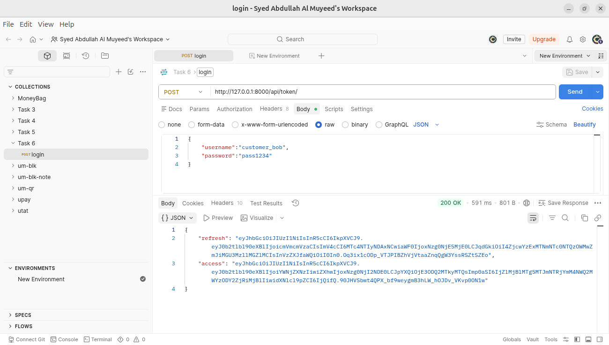
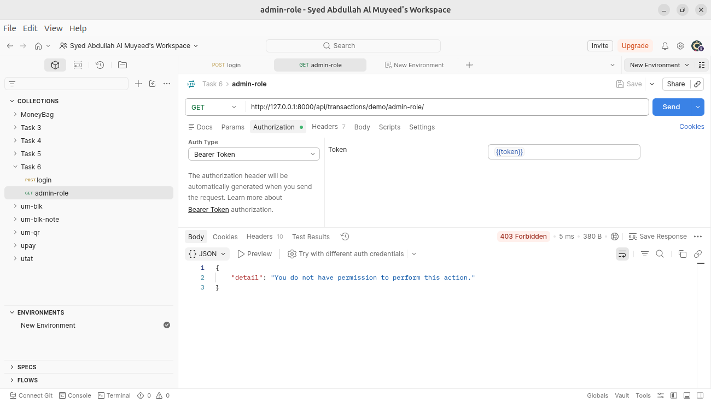
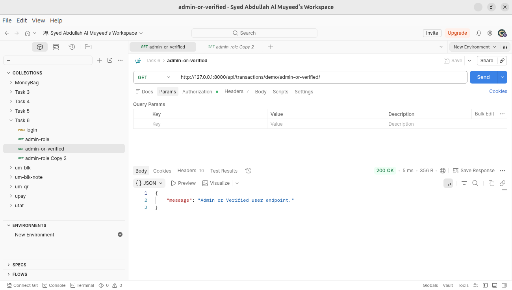
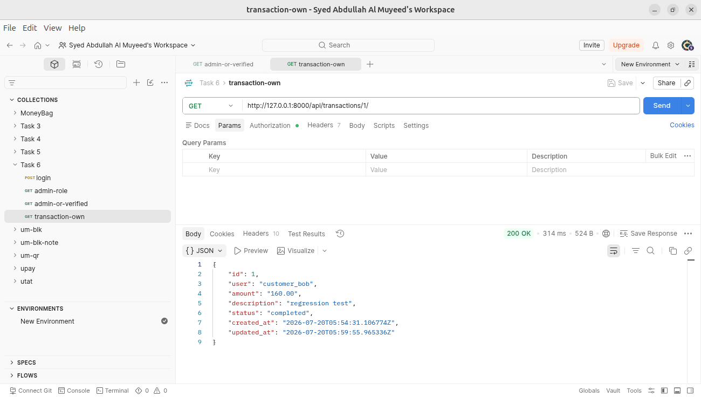
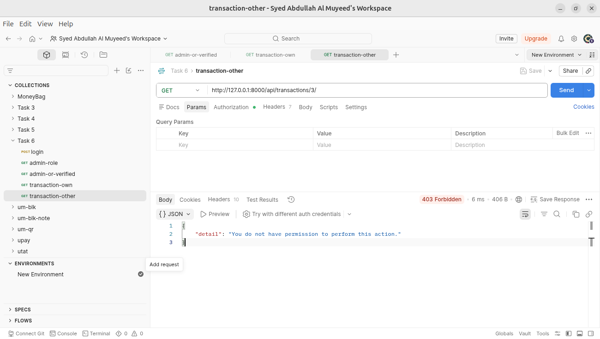
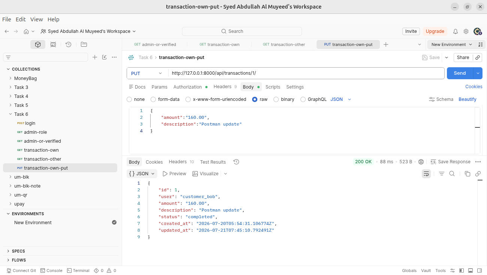
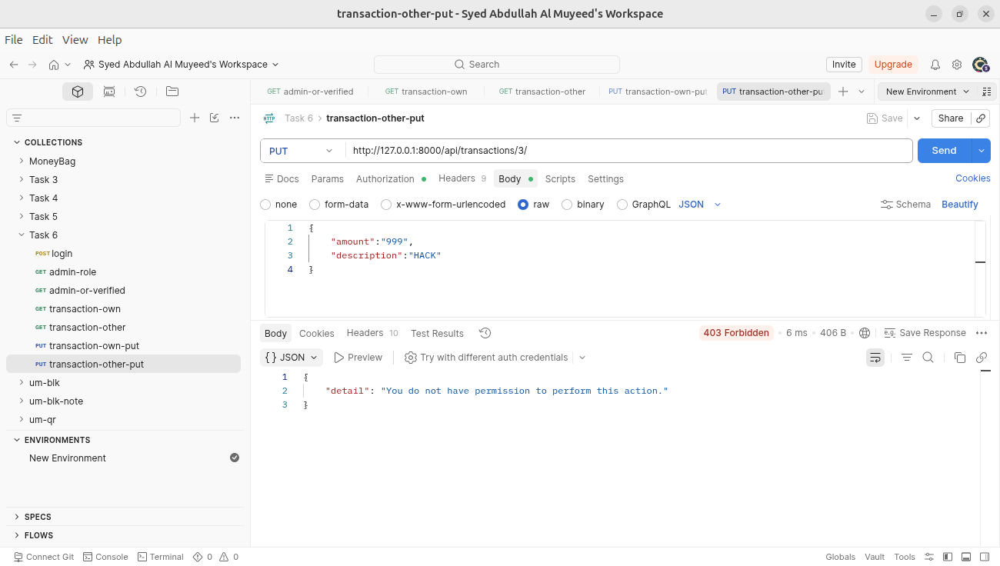
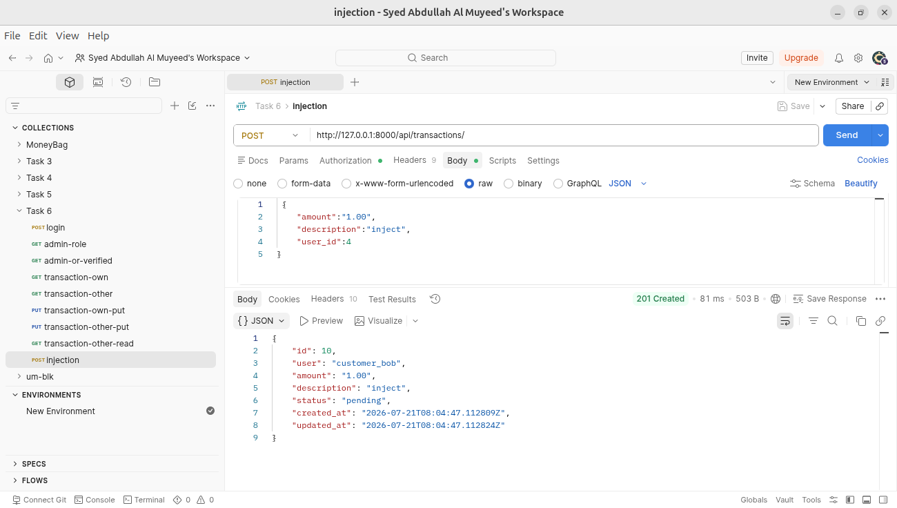
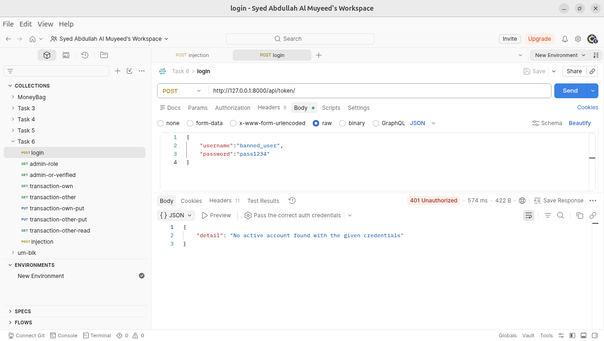
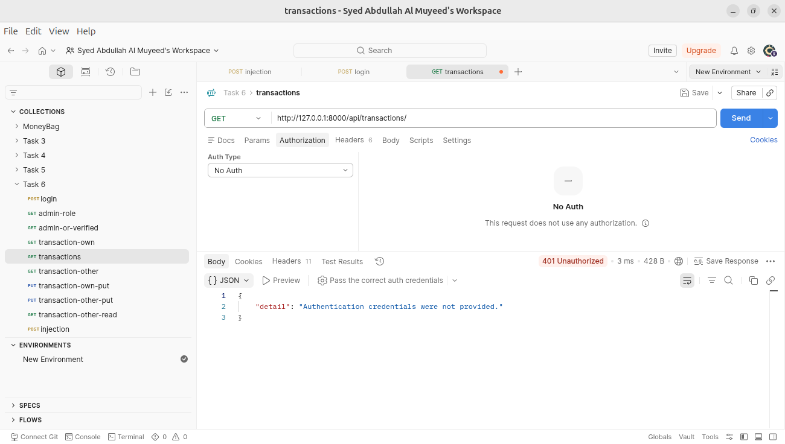

# Django RBAC + Object-Level Permissions

DRF permission system with custom permission classes, role-based access control (3 roles), composable AND/OR permission combinators, and row-level object security. Built with Django 6.0, DRF 3.17, django-guardian, and SimpleJWT.

## Quick Start

```bash
pip install django djangorestframework djangorestframework-simplejwt django-guardian
python manage.py migrate
python manage.py seed_data
python manage.py runserver
```

Import `postman_collection.json` into Postman for all pre-configured requests.

### Test Users (password: `pass1234`)

| Username         | Role     | Verified | Active |
| ---------------- | -------- | :------: | :----: |
| `admin_user`     | Admin    |   Yes    |  Yes   |
| `agent_jane`     | Agent    |   Yes    |  Yes   |
| `customer_bob`   | Customer |   Yes    |  Yes   |
| `customer_alice` | Customer |   Yes    |  Yes   |
| `unverified_eve` | Customer |    No    |  Yes   |
| `banned_user`    | Customer |   Yes    |   No   |

---

## Screenshots

Replace each placeholder in `screenshots/` with the matching Postman screenshot.

### 1. JWT Token Obtain



### 2. RBAC - Role Checks

Admin hits `/demo/admin-role/` - 200



### 3. AND/OR Permission Combinators

OR: verified user passes, unverified fails



### 4. Row-Level Object Security

Bob GET his own transaction - 200



Bob GET Alice's transaction - 403



Bob PUT his own transaction - 200



Bob PUT Alice's transaction - 403



### 5. Attack Vectors

Bob injects `user_id:4` in POST body - assigned to Bob, not Alice



Banned user login - 401



No token - 401



---

## Custom Permission Classes

| Class                           | Type   | Description                                     |
| ------------------------------- | ------ | ----------------------------------------------- |
| `IsAccountOwner`                | Object | `obj.user == request.user`                      |
| `IsVerifiedUser`                | Global | User must have `is_verified=True`               |
| `IsActiveAccount`               | Global | User must have `is_active=True`                 |
| `HasRole(*roles)`               | Global | User `role` field must match one of `*roles`    |
| `IsAdmin`                       | Global | `HasRole('admin')`                              |
| `IsAgent`                       | Global | `HasRole('agent')`                              |
| `IsCustomer`                    | Global | `HasRole('customer')`                           |
| `IsAdminOrAgent`                | Global | `HasRole('admin', 'agent')`                     |
| `IsTransactionOwner`            | Object | `IsAccountOwner` extended for Transaction model |
| `IsOwnerOrAdminOrAgentReadOnly` | Object | Owner: full. Admin: full. Agent: GET only.      |
| `AND(*permissions)`             | Combo  | All listed permissions must pass                |
| `OR(*permissions)`              | Combo  | At least one listed permission must pass        |

### Usage Examples

```python
# Built-in DRF permissions
permission_classes = [IsAuthenticated]
permission_classes = [IsAdminUser]
permission_classes = [IsAuthenticatedOrReadOnly]

# Custom standalone
permission_classes = [IsVerifiedUser]
permission_classes = [IsActiveAccount]

# Role-based
permission_classes = [IsAdmin]
permission_classes = [HasRole('admin', 'agent')]

# Composability -- AND / OR
permission_classes = [AND(IsAuthenticated, IsActiveAccount, IsVerifiedUser)]
permission_classes = [OR(IsAdmin, IsVerifiedUser)]

# Object-level on ViewSet detail actions
def get_object(self):
    obj = super().get_object()
    self.check_object_permissions(self.request, obj)
    return obj
```

---

## Roles

| Role     | Capabilities                                                       |
| -------- | ------------------------------------------------------------------ |
| Admin    | Full read/write on all resources. Object-level checks bypassed.    |
| Agent    | Read-only access to all transactions. Cannot create/update/delete. |
| Customer | Full CRUD on own transactions only. Cannot access others' data.    |

---

## Permission Matrix: Endpoint x Role

### Legend

| Symbol | Meaning                   |
| ------ | ------------------------- |
| `+`    | Allowed (200/201)         |
| `-`    | Denied (403 Forbidden)    |
| `401`  | Denied (401 Unauthorized) |
| `OWN`  | Object-level: owner only  |
| `*`    | See footnote              |

### Authentication

| Endpoint              | Method | Unauthenticated | Admin | Agent | Cust(verified) | Cust(unverified) | Banned |
| --------------------- | ------ | :-------------: | :---: | :---: | :------------: | :--------------: | :----: |
| `/api/token/`         | POST   |        +        |   +   |   +   |       +        |        +         |  401   |
| `/api/token/refresh/` | POST   |       401       |   +   |   +   |       +        |        +         |  401   |

### Account

| Endpoint                  | Method | Unauthenticated | Admin | Agent | Cust(verified) | Cust(unverified) | Banned |
| ------------------------- | ------ | :-------------: | :---: | :---: | :------------: | :--------------: | :----: |
| `/api/accounts/register/` | POST   |        +        |   +   |   +   |       +        |        +         |   +    |
| `/api/accounts/profile/`  | GET    |       401       |   +   |   +   |       +        |        +         |  401   |
| `/api/accounts/users/`    | GET    |       401       |  +\*  |   -   |       -        |        -         |  401   |

`*` Requires `is_staff=True` (built-in `IsAdminUser`). Admin role alone is insufficient.

### Transactions: ViewSet CRUD

| Endpoint                  | Method     | Unauthenticated | Admin | Agent | Cust(own) | Cust(other) | Unverified | Banned |
| ------------------------- | ---------- | :-------------: | :---: | :---: | :-------: | :---------: | :--------: | :----: |
| `/api/transactions/`      | GET (list) |       401       |   +   |   +   |    OWN    |      -      |     -      |  401   |
| `/api/transactions/`      | POST       |       401       |   -   |   -   |     +     |     n/a     |     -      |  401   |
| `/api/transactions/{id}/` | GET        |       401       |   +   |   +   |    OWN    |      -      |     -      |  401   |
| `/api/transactions/{id}/` | PUT/PATCH  |       401       |   +   |   -   |    OWN    |      -      |     -      |  401   |
| `/api/transactions/{id}/` | DELETE     |       401       |   +   |   -   |    OWN    |      -      |     -      |  401   |

### Transactions: Function-Based Views

| Endpoint                      | Method     | Admin | Agent | Cust(own) | Cust(other) |
| ----------------------------- | ---------- | :---: | :---: | :-------: | :---------: |
| `/api/transactions/fbv/`      | GET (list) |   +   |   +   |    OWN    |      -      |
| `/api/transactions/fbv/`      | POST       |   -   |   -   |     +     |     n/a     |
| `/api/transactions/fbv/{id}/` | GET        |   +   |   +   |    OWN    |      -      |
| `/api/transactions/fbv/{id}/` | PUT/PATCH  |   +   |   -   |    OWN    |      -      |
| `/api/transactions/fbv/{id}/` | DELETE     |   +   |   -   |    OWN    |      -      |

### Demo Endpoints

| Endpoint                                      | Permission Check                       | Admin | Agent | Cust | Unverified | Unauthenticated |
| --------------------------------------------- | -------------------------------------- | :---: | :---: | :--: | :--------: | :-------------: |
| `/api/transactions/demo/authenticated/`       | `IsAuthenticated`                      |   +   |   +   |  +   |     +      |       401       |
| `/api/transactions/demo/admin/`               | `IsAdminUser` (built-in)               |   +   |   -   |  -   |     -      |       401       |
| `/api/transactions/demo/auth-readonly/`       | `IsAuthenticatedOrReadOnly`            |   +   |   +   |  +   |     +      |     +(GET)      |
| `/api/transactions/demo/admin-role/`          | `HasRole('admin')`                     |   +   |   -   |  -   |     -      |       401       |
| `/api/transactions/demo/agent-role/`          | `HasRole('agent')`                     |   -   |   +   |  -   |     -      |       401       |
| `/api/transactions/demo/customer-role/`       | `HasRole('customer')`                  |   -   |   -   |  +   |     +      |       401       |
| `/api/transactions/demo/admin-or-agent/`      | `HasRole('admin','agent')`             |   +   |   +   |  -   |     -      |       401       |
| `/api/transactions/demo/admin-or-verified/`   | `OR(IsAdmin, IsVerifiedUser)`          |   +   |   -   |  +   |     -      |       401       |
| `/api/transactions/demo/verified-and-active/` | `AND(IsVerifiedUser, IsActiveAccount)` |   +   |   +   |  +   |     -      |       401       |

---

## Object-Level (Row-Level) Security

### Mechanism

1. **List actions**: `get_queryset()` filters by `user=request.user` for customers. Admins and agents see all records.
2. **Detail/update/delete actions**: `get_queryset()` returns unfiltered; `get_object()` calls `check_object_permissions()` which invokes `IsOwnerOrAdminOrAgentReadOnly`.
3. **Admins** bypass all object-level checks.
4. **Agents** can GET any transaction but cannot modify or delete.
5. **Customers** receive 403 on any access to another customer's transaction.

### Attack Vectors Tested

| Attack                                                    |    Result     |
| --------------------------------------------------------- | :-----------: |
| Inject `user_id` in POST body to impersonate another user |    BLOCKED    |
| Access another customer's transaction by ID (GET)         | BLOCKED (403) |
| Modify another customer's transaction (PUT/PATCH)         | BLOCKED (403) |
| Delete another customer's transaction                     | BLOCKED (403) |
| Agent attempts to modify a transaction                    | BLOCKED (403) |
| Agent attempts to delete a transaction                    | BLOCKED (403) |
| Unverified user creates a transaction                     | BLOCKED (403) |
| Inactive (banned) user login                              | BLOCKED (401) |
| Request with no token / invalid token                     | BLOCKED (401) |
| Unauthenticated POST to protected endpoint                | BLOCKED (401) |

---

## Project Structure

```
.
├── config/                    # Django project settings
│   ├── settings.py
│   ├── urls.py
│   └── wsgi.py
├── accounts/                  # User model, auth, permissions
│   ├── models.py              # Custom User with role + is_verified
│   ├── permissions.py         # All custom permission classes
│   ├── serializers.py         # RegisterSerializer, UserSerializer
│   ├── views.py               # RegisterView, ProfileView, UserListView
│   ├── urls.py
│   └── management/commands/
│       └── seed_data.py       # Creates test users + transactions
├── transactions/              # Transaction CRUD with RBAC
│   ├── models.py              # Transaction model
│   ├── serializers.py         # TransactionSerializer
│   ├── views.py               # TransactionViewSet, FBVs, demo endpoints
│   └── urls.py
├── screenshots/               # Postman screenshot placeholders
├── postman_collection.json    # Import into Postman
├── manage.py
└── README.md
```

## Adding Screenshots

1. Import `postman_collection.json` into Postman
2. Set `base_url` variable to `http://localhost:8000`
3. Run the pre-configured requests per role
4. Capture each response
5. Save screenshots into `screenshots/` matching the filenames in the table above

## Django System Check

```bash
python manage.py check
```
