# JWT Authentication System

**Name:** Syed Abdullah Al Muyeed  
**ID:** FT0061-I  
**Designation:** Information Technology Intern

## API Endpoints

| Method | Endpoint                     | Description                      | Auth |
| ------ | ---------------------------- | -------------------------------- | :--: |
| POST   | `/api/register/`             | Register and get JWT pair        |  No  |
| POST   | `/api/login/`                | Login with email + password      |  No  |
| POST   | `/api/logout/`               | Logout, blacklist refresh token  | Yes  |
| POST   | `/api/token/refresh/`        | Refresh JWT pair with rotation   |  No  |
| GET    | `/api/sessions/`             | List sessions (device, IP, time) | Yes  |
| POST   | `/api/sessions/<id>/revoke/` | Revoke one session               | Yes  |
| POST   | `/api/sessions/revoke-all/`  | Revoke all sessions              | Yes  |
| POST   | `/api/token-auth/`           | DRF TokenAuth (email-based)      |  No  |
| POST   | `/api/token/`                | SimpleJWT built-in obtain pair   |  No  |
| POST   | `/api/token/verify/`         | SimpleJWT built-in verify        |  No  |

## Tests

```bash
python manage.py test accounts --verbosity=2
```

## Testing Guide

Create superuser:

```bash
python manage.py createsuperuser
```

## Postman Screenshots

Start server: `python manage.py runserver`

### 1. Register

POST `/api/register/` with body `{"email":"muyeed@email.com","password":"muyeed123"}`
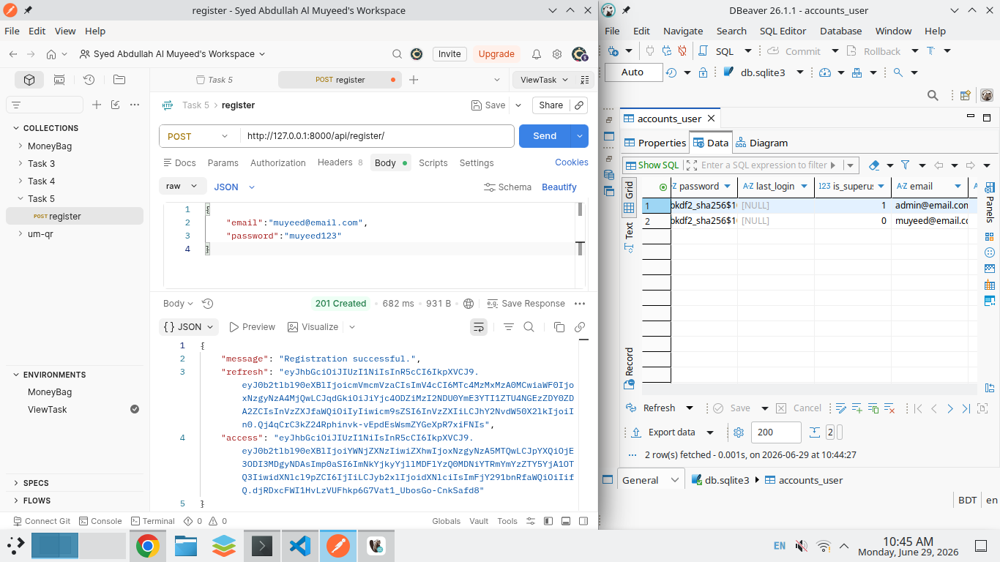

### 2. Login

POST `/api/login/` with body `{"email":"muyeed@email.com","password":"muyeed123"}`
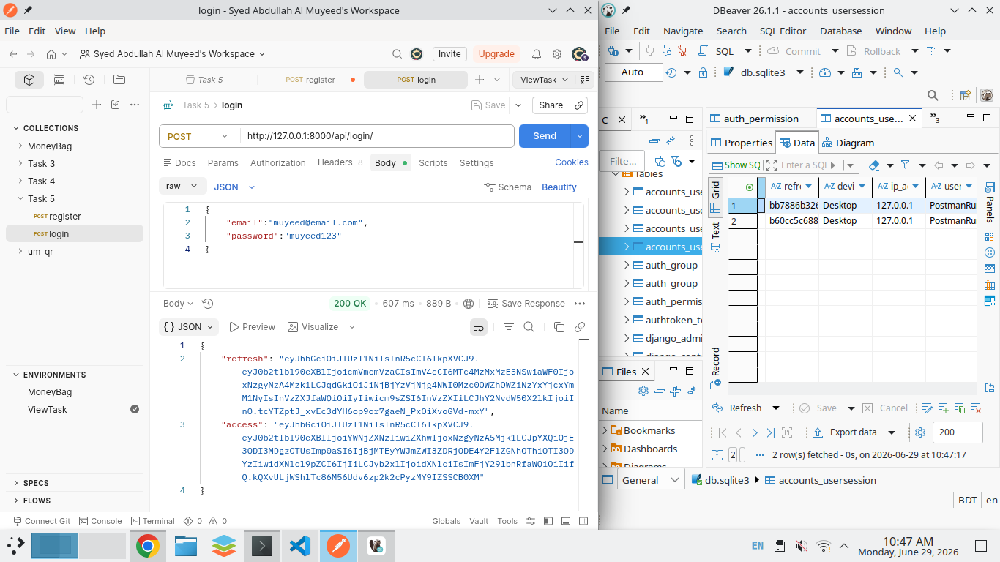

### 3. JWT Claims

Paste access token at [jwt.io](https://jwt.io), show decoded `role` and `account_id`
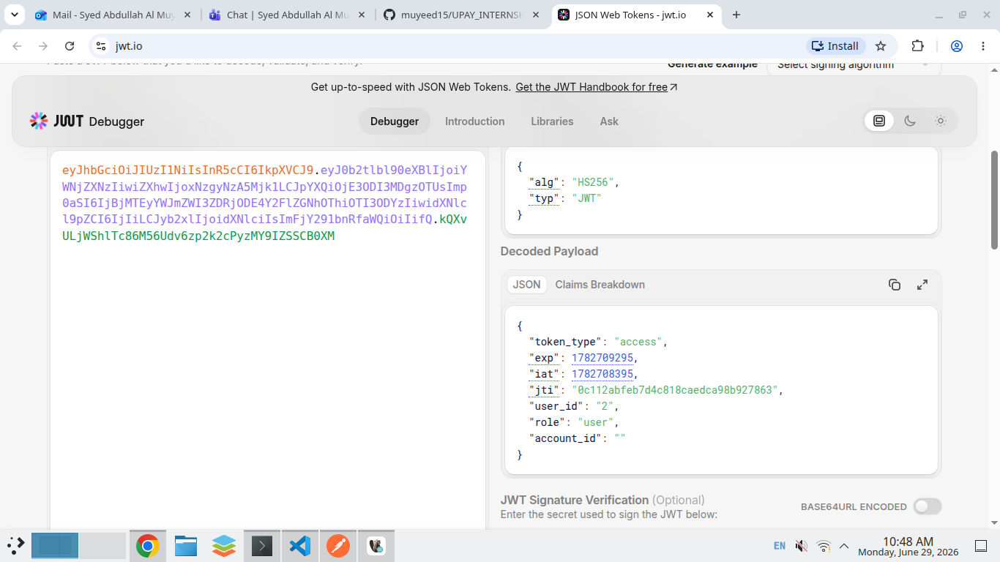

### 4. Session List

GET `/api/sessions/` with header `Authorization: Bearer <access>`
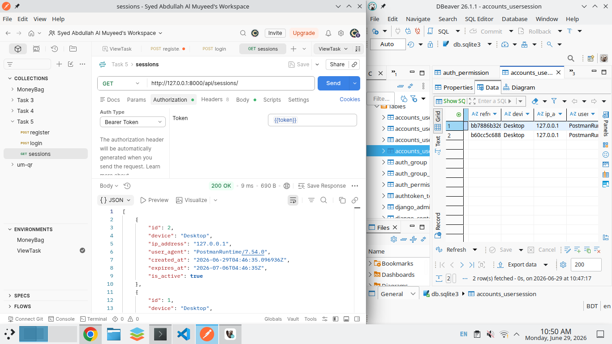

### 5. Token Refresh

POST `/api/token/refresh/` with body `{"refresh":"<old_refresh>"}`
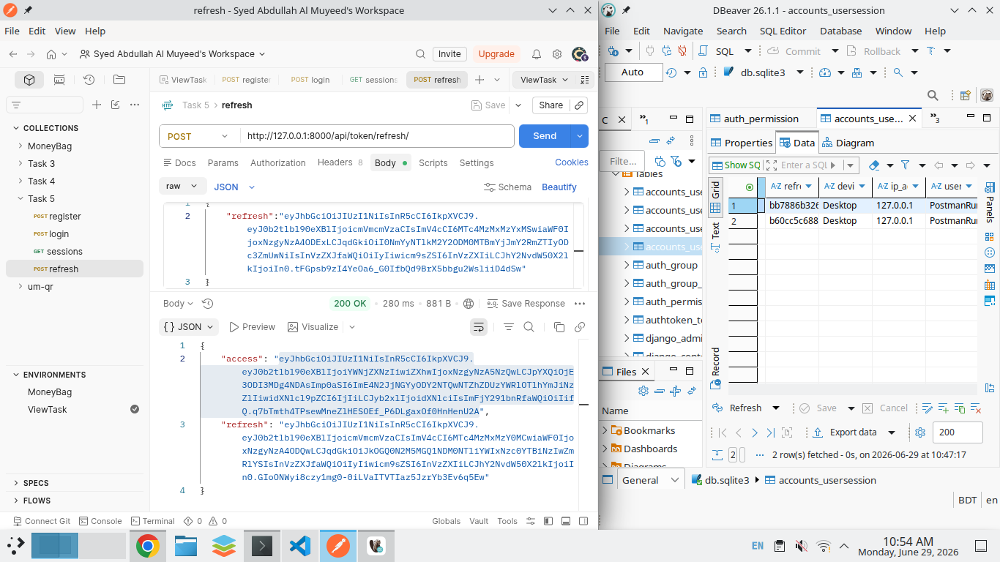

### 6. Sessions After Refresh

GET `/api/sessions/` with header `Authorization: Bearer <new_access>` (old inactive, new active)
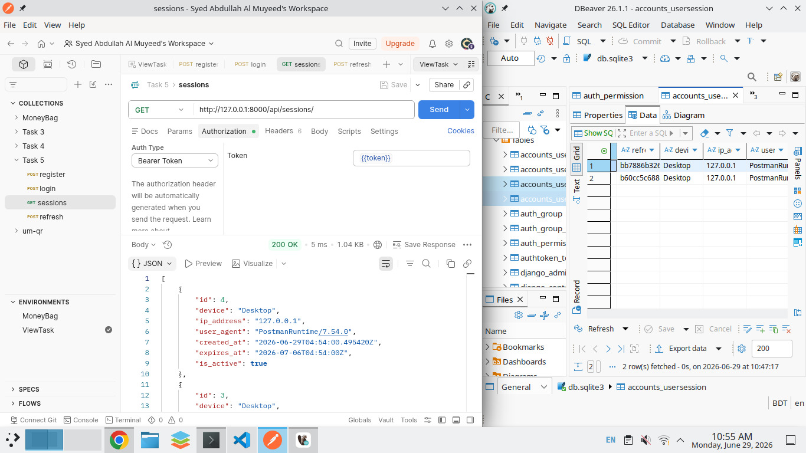

### 7. Revoke Session

POST `/api/sessions/<id>/revoke/` with header `Authorization: Bearer <access>`
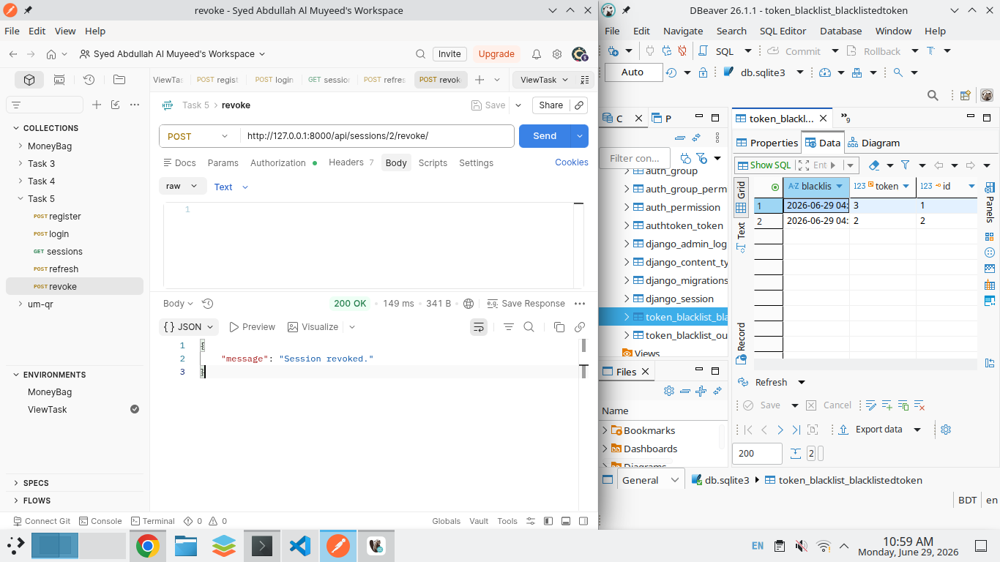

### 8. Revoke All

POST `/api/sessions/revoke-all/` with header `Authorization: Bearer <access>`
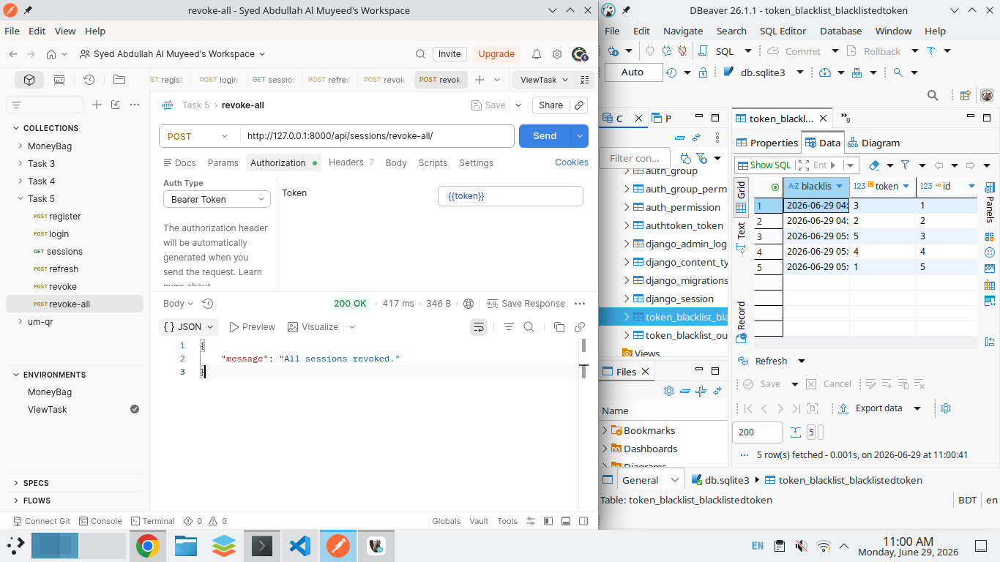

### 9. Logout

POST `/api/logout/` with body `{"refresh":"<token>"}` plus auth header
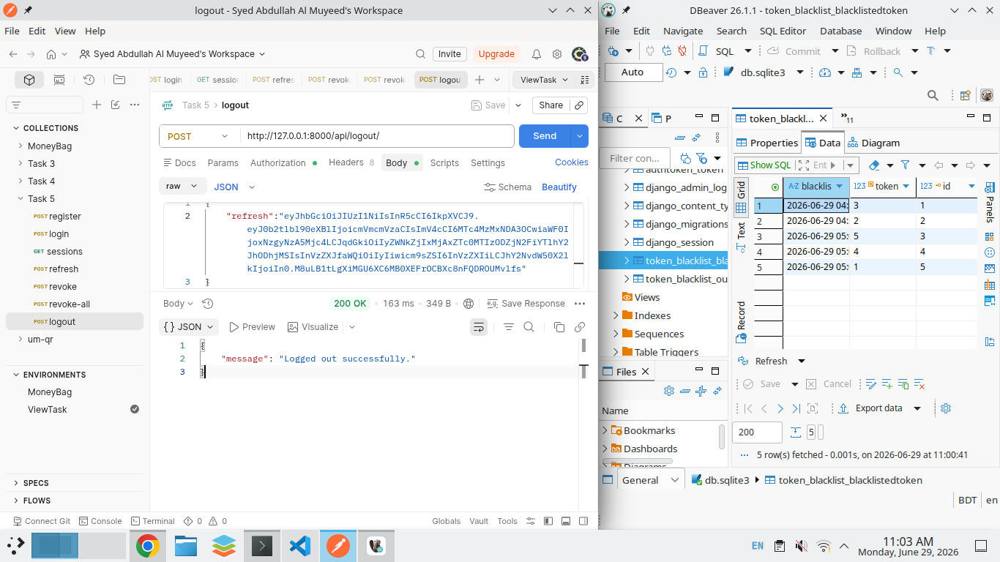

### 10. DRF TokenAuth

POST `/api/token-auth/` with body `{"email":"muyeed@email.com","password":"muyeed123"}`
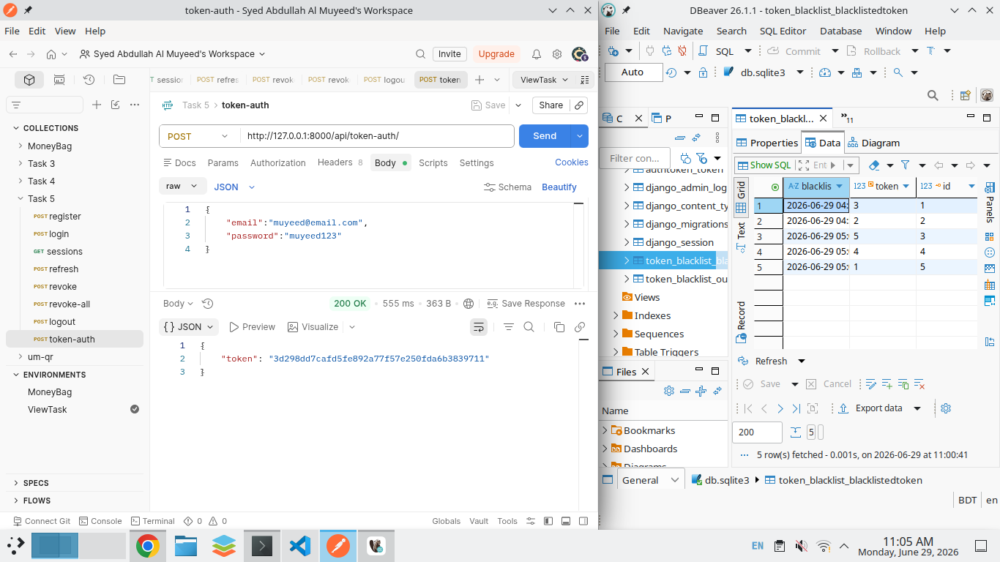

### 11. JWT vs TokenAuth

GET `/api/sessions/` side by side: `Bearer <jwt>` vs `Token <drf_token>`
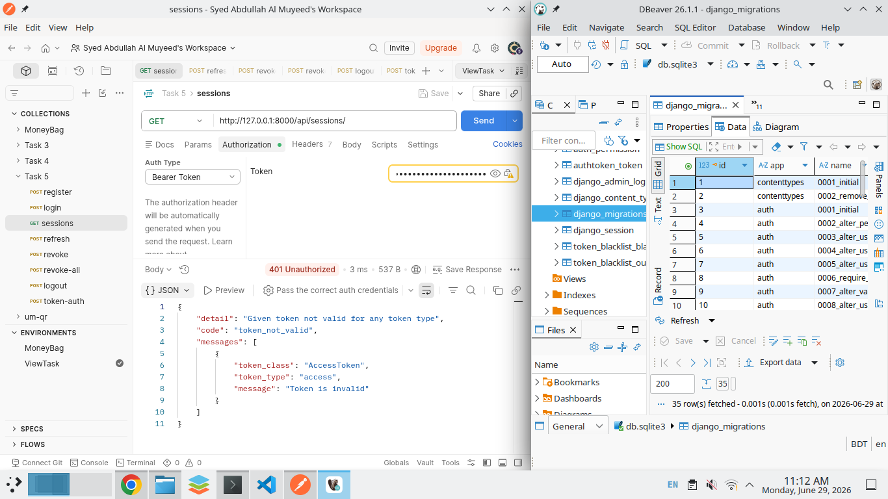

### 12. Stolen Refresh Rejected

POST `/api/token/refresh/` with already-rotated token, returns 401
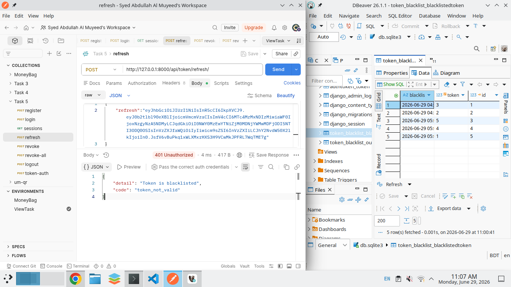
